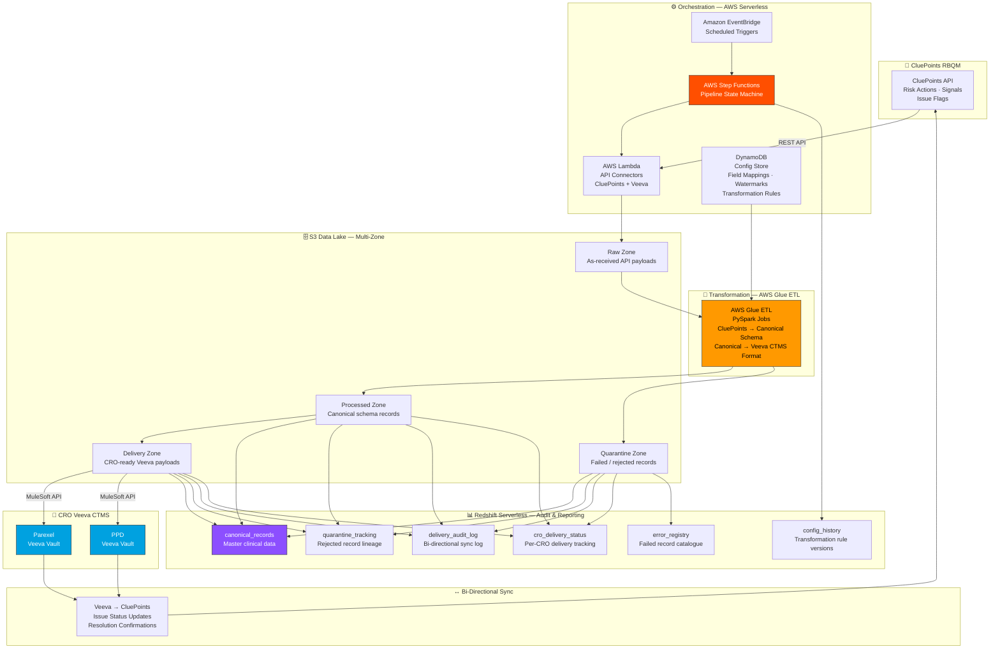

# Clinical Data Integration Platform


> **Enterprise-grade bi-directional clinical data integration platform** — connecting CluePoints RBQM (Risk-Based Quality Management) to CRO Veeva CTMS systems (Parexel, PPD) via a fully serverless AWS pipeline. Replaces manual SharePoint-based workflows with automated, auditable, pharma-compliant data exchange.

---

## 📐 Architecture



---

## 🎯 Problem Statement

Clinical trial operations teams at a pharmaceutical company were manually exporting risk signals from CluePoints RBQM, reformatting them in SharePoint spreadsheets, and sending them to CRO partners (Parexel, PPD) who manually entered data into Veeva CTMS. The process took 3–5 days per cycle, introduced transcription errors, and produced no audit trail for regulatory review.

## ✅ Solution

A fully serverless, modular AWS pipeline with connector-based CRO integration — automating the bi-directional data flow between CluePoints and Veeva CTMS. Risk actions in CluePoints automatically create Issues in Veeva Vault via MuleSoft APIs; status updates in Veeva sync back to CluePoints. A 6-table Redshift Serverless warehouse provides end-to-end data lineage and audit logs for regulatory compliance.

---

## 📊 Key Metrics

| Metric | Before (Manual) | After (Automated) |
|---|---|---|
| Data exchange cycle time | 3–5 days | < 1 hour |
| Manual effort per cycle | ~20 person-hours | 0 (fully automated) |
| Transcription error rate | ~3–5% | 0% (validated pipeline) |
| CROs supported | 1 (manual) | Multi-CRO (extensible) |
| Audit trail | None | 6-table Redshift lineage |
| Regulatory readiness | Manual evidence gathering | Automated audit logs |

---

## 🛠️ Tech Stack

| Layer | Technology |
|---|---|
| Scheduling | Amazon EventBridge |
| Orchestration | AWS Step Functions |
| API Connectivity | AWS Lambda (Python) |
| Transformation | AWS Glue ETL (PySpark) |
| Config & Watermarks | Amazon DynamoDB |
| Storage | Amazon S3 (Raw / Processed / Quarantine / Delivery) |
| File Format | Apache Parquet (partitioned) |
| Data Warehouse | Amazon Redshift Serverless (6 tables) |
| CRO Integration | MuleSoft APIs → Veeva Vault |
| Monitoring | Amazon CloudWatch, SNS |
| CI/CD | GitHub Actions |

---

## 📁 Project Structure

```
clinical-data-integration-platform/
├── connectors/
│   ├── cluepoints/
│   │   ├── client.py                 # CluePoints REST API client
│   │   ├── risk_action_extractor.py  # Risk action extraction logic
│   │   └── models.py                 # CluePoints data models
│   ├── veeva/
│   │   ├── client.py                 # Veeva Vault API client (via MuleSoft)
│   │   ├── issue_creator.py          # Create Issues in Veeva Vault
│   │   └── status_sync.py            # Bi-directional status reconciliation
│   └── base_connector.py             # Abstract connector interface
├── lambda/
│   ├── cluepoints_ingestion/
│   │   └── handler.py                # Trigger: pull CluePoints risk actions
│   ├── veeva_delivery/
│   │   └── handler.py                # Trigger: push to Veeva via MuleSoft
│   ├── bidirectional_sync/
│   │   └── handler.py                # Sync Veeva status → CluePoints
│   └── error_handler/
│       └── handler.py                # Quarantine routing + SNS alerts
├── glue/
│   ├── jobs/
│   │   ├── cluepoints_to_canonical.py    # Raw → Canonical schema transform
│   │   └── canonical_to_veeva.py         # Canonical → CRO-specific Veeva format
│   └── utils/
│       ├── config_loader.py          # DynamoDB config + field mapping loader
│       ├── watermark_manager.py      # Incremental load watermark R/W
│       └── schema_validator.py       # Canonical schema validation
├── step_functions/
│   ├── ingestion_pipeline.json       # CluePoints → S3 → Glue state machine
│   ├── delivery_pipeline.json        # Canonical → Veeva delivery state machine
│   └── sync_pipeline.json            # Bi-directional sync state machine
├── redshift/
│   ├── ddl/
│   │   ├── canonical_records.sql
│   │   ├── quarantine_tracking.sql
│   │   ├── delivery_audit_log.sql
│   │   ├── cro_delivery_status.sql
│   │   ├── config_history.sql
│   │   └── error_registry.sql
│   └── views/
│       └── regulatory_audit_view.sql # Compliance reporting view
├── dynamo/
│   └── seed/
│       ├── field_mappings.json       # CluePoints → Veeva field map
│       └── cro_config.json           # Per-CRO transformation rules
├── config/
│   └── environment.yaml              # Environment-specific settings
├── tests/
│   ├── test_cluepoints_client.py
│   ├── test_transformation.py
│   ├── test_veeva_delivery.py
│   └── test_bidirectional_sync.py
├── .github/
│   └── workflows/
│       ├── ci.yml
│       └── deploy.yml
└── README.md
```

---

## ⚙️ Key Engineering Decisions

- **Connector-based modular design** — each CRO (Parexel, PPD) has its own connector implementation behind a common interface, enabling new CRO onboarding without touching core pipeline logic.
- **DynamoDB as config store** — field mappings and transformation rules stored in DynamoDB (not hardcoded) so CRO-specific schema changes are configuration changes, not deployments.
- **Idempotent DELETE+INSERT load pattern** — Redshift loads use a delete-then-insert approach with unique record identifiers, ensuring re-runs from the same watermark never produce duplicate records.
- **Quarantine zone + error registry** — rejected records are stored with full error metadata in S3 (Quarantine) and catalogued in Redshift (error_registry), enabling targeted reprocessing without full pipeline re-runs.
- **Multi-zone S3 data lake** — separating Raw, Processed, Quarantine, and Delivery zones provides clear data lineage and enables point-in-time replay at any stage — critical for regulatory audit responses.

---

## 🚀 Quick Start

```bash
# Clone the repo
git clone https://github.com/jesseantony/clinical-data-integration-platform.git
cd clinical-data-integration-platform

# Configure AWS credentials
aws configure

# Deploy infrastructure (Lambda, Glue, Step Functions, Redshift, DynamoDB)
aws cloudformation deploy \
  --template-file infra/stack.yaml \
  --stack-name clinical-integration \
  --capabilities CAPABILITY_IAM

# Seed DynamoDB config
python dynamo/seed/seed_config.py --env dev

# Run test suite
pip install -r requirements.txt
pytest tests/ -v

# Trigger ingestion pipeline manually
aws stepfunctions start-execution \
  --state-machine-arn <ingestion-state-machine-arn> \
  --input '{}'
```

---

## 🔐 Compliance Notes

- All data in transit encrypted via TLS 1.2+
- S3 buckets encrypted at rest (AES-256 / SSE-KMS)
- Redshift encrypted at rest with AWS KMS
- DynamoDB field mappings include data classification metadata
- Full audit trail maintained across all 6 Redshift tables
- Access controlled via IAM roles with least-privilege policies

---

## 📌 Topics

`aws` `clinical-trials` `ctms` `cluepoints` `veeva` `rbqm` `pharma` `data-engineering` `aws-glue` `pyspark` `step-functions` `lambda` `redshift` `dynamodb` `python` `bi-directional-sync`
